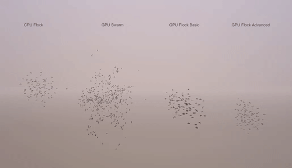

# Unity-GPU-Boids

This project was made to learn from compute shaders and to have a reference for similar project. 
It contains several implementations to see how some compare to others, check out the different folders in `Assets`.

    <!--  -->
    
    

**Features**
- Flocking behaviour
- Parameters: speed, size, rotation, radius check...
- Skinned Mesh Boid animation data used on GPU
- Vertex frame interpolation
- Affectors with force and distance
- Convert data points to drawing
- Bitonic sorting

**Benchmarks**

Using a GTX 980 Ti
| Implementation | 1000 Boids | 4000 Boids | 32000 Boids
| --- | :---: | :---: | :---:
| **CPU Flock** | 20 FPS | 3 FPS | < 1 FPS
| **CPU Draw/GPU Compute** | 126 FPS | 14 FPS | < 1 FPS
| **GPU Flock** | > 1000 FPS | > 1000 FPS | 93 FPS
| **GPU Flock multilateration** | > 1000 FPS | 400 FPS | 42 FPS
| **GPU Flock bitonic sorting** | > 1000 FPS | 950 FPS | 20 FPS
| **GPU Flock skinned and affectors** | > 1000 FPS | > 1000 FPS | 80 FPS

It seems my tests to optimize with different implementations failed and a brute for loop seems to be faster than any other method. 

GPU Flock for each boid will check against every other boids if it's in its range, so we got a stable 32k loop every frame. Bitonic sorting on the other hand will average at 5k loop but still is slower, what's interesting it the fact that the bitonic sort does not seem to be the problem but the fact that every frame we do not loop the same amount of times. Check out `Boids_Bitonic.compute` for more infos, will be glad to have some feedback on that.

**Notes**

A few tips and notes about compute shaders. 
Padding had a great impact on performance where I could increase my FPS by 10% at times. Strangely I read that padding to 16 bytes is what is suggested but in my experiments I had to add 4 to 8 additional bytes sometimes (see `Boid_Simple.compute`). 
An array access (like MyStructuredBuffer[instanceId]) is really costly so when I had to access my buffer more than once I logically cached it in a variable, but some of the time it was more performant to access it again without caching it, probably will depend of the size of your struct and the number of time you access it. 
Do not use ComputeBuffer.GetData() it will tank your performance, try to like this project pass around values in buffers and things will become fast as hell. If you really have to then try out the experimental Async GetData().

**Requirements**
- Tested on Unity 2017+
- Plateform that supports compute shaders

**Credits**
- [CPU Flocking by keijiro](https://github.com/keijiro/Boids)
- [Base conversion CPU Flocking to GPU by chenjd](https://github.com/chenjd/Unity-Boids-Behavior-on-GPGPU/)
